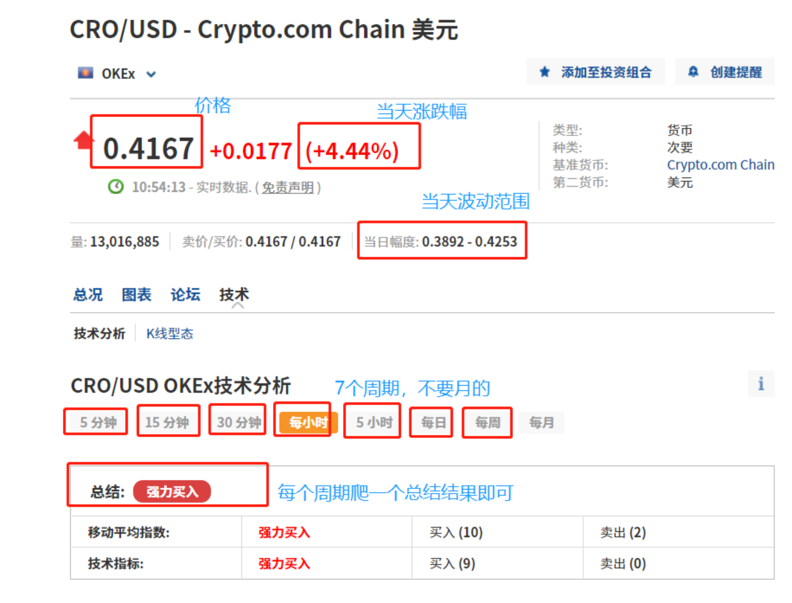

# cn.investing.com 爬虫


## 安装依赖

python3.6+

```shell
pip install -r requirements.txt
```

## 启动服务

```shell
sh run.sh
```

## URL
不需要任何参数
- http://ip:port/coin_signal

## 请求格式

GET方式，须带上http请求头

**http请求头**

| HTTP header  | 必选 | 说明             |
| ------------ | ---- | ---------------- |
| Content-Type | 是   | application/json |

## 返回值

请求成功则返回json格式串，格式如下

| 参数名 | 类型                        | 说明                          |
| ------ | --------------------------- | ----------------------------- |
| code   | Integer                     | 0为成功，-1为失败             |
| data   | Array of **Result**(Object) | 每个事件文本对的排重/聚簇结果 |
| time   | String                      | 爬取结束的时间                    |

**Result**(Object)数据格式

| 参数名 | 类型            | 说明                                      |
| ------ | --------------- | --------------------------------- |
| coin_pair  | String | 交易对，格式为 $toekn-usd                |
| investing_signal  | **Single**(Object) | 交易信号         |
| cur_price  | String | 当前价格         |
| today_chg  | String | 当天涨跌幅         |
| price_low  | String | 当天最低价        |
| price_high  | String | 当天最高价        |

**Single**(Object)数据格式

| 参数名 | 类型            | 说明                                      |
| ------ | --------------- | --------------------------------- |
| 1 分钟  | String |                 |
| 5 分钟  | String |            |
| 15 分钟  | String |                 |
| 30 分钟  | String |            |
|  每小时 | String |                 |
| 5 小时  | String |            |
| 每日  | String |                 |
| 每周  | String |            |
| 每月  | String |            |


### 返回样例
```buildoutcfg
{
	'data': [
	    {
	        'coin_pair': 'btc-usd',
			'investing_signal': {
				'1 分钟': '强力买入',
				'5 分钟': '强力买入',
				'15 分钟': '强力买入',
				'30 分钟': '强力买入',
				'每小时': '强力买入',
				'5 小时': '强力买入',
				'每日': '强力买入',
				'每周': '卖出',
				'每月': '强力卖出'
			},
			'cur_price': '37,844.0',
			'today_chg': '+2.81%',
			'price_low': '36,197.0',
			'price_high': '38,055.0',
			'rank': '1'
		},
		{
		   'coin_pair': 'eth-usd',
			'investing_signal': {
				'5 分钟': '买入',
				'15 分钟': '买入',
				'30 分钟': '强力买入',
				'每小时': '强力买入',
				'5 小时': '强力买入',
				'每日': '买入',
				'每周': '强力卖出',
				'每月': '强力卖出'
			},
			'cur_price': '2,555.78',
			'today_chg': '+5.46%',
			'price_low': '2,357.88',
			'price_high': '2,585.89',
			'rank': '2'

		}
	],
	'time': '2022-01-29 15:33:18',
	'code': 0
}
```
